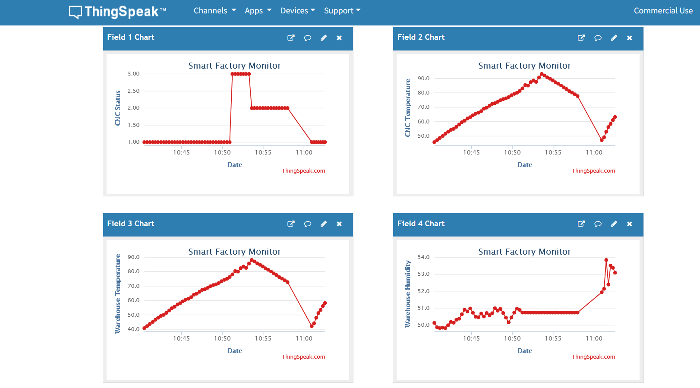

🏭 Smart Factory IoT Monitor: Digital Twin Simulator

An end-to-end IoT monitoring solution that simulates a industrial CNC machine's telemetry. This project demonstrates Digital Twin concepts, real-time cloud synchronization, and edge data persistence.
🚀 Key Features

    Digital Twin Logic: Simulates realistic machine behavior including thermal momentum, idle cooling cycles, and state-based fault generation.

    Edge Data Logging: Implements local data persistence via CSV to ensure data integrity during potential network outages.

    Cloud Analytics: Real-time data visualization via ThingSpeak REST API for remote factory monitoring.

    Automated Anomaly Detection: Logic-driven state changes (e.g., transition to 'Fault' state) based on environmental safety thresholds.

🛠️ Tech Stack

    Language: Python 3.x

    Libraries: requests, csv, time, random

    Cloud Platform: ThingSpeak (IoT Analytics)

    Protocol: HTTP/REST

📊 System Architecture

The system simulates an industrial environment where machine status and temperature are correlated. When the "machine" is in a Running state, temperature rises; once thresholds are exceeded, the system triggers a Fault state to simulate emergency shutdown procedures.

